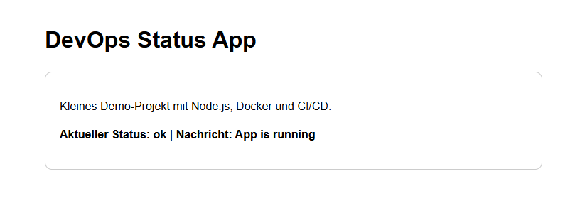

# DevOps Status App

[](https://github.com/L-2Code/devops-status-app/actions/workflows/ci.yml)

A containerized demo application showcasing a simple DevOps setup with a frontend served via Nginx, a backend API built with Express, and a CI pipeline using GitHub Actions.

A containerized demo application showcasing a simple DevOps setup with a frontend served via Nginx, a backend API built with Express, and a CI pipeline using GitHub Actions.

---

## Overview

This project demonstrates how to:

* Containerize a multi-service application using Docker
* Use Nginx as a reverse proxy
* Build and run services via Docker Compose
* Implement a basic CI pipeline with GitHub Actions
* Structure a simple backend with health and status endpoints

---

## Screenshot

The following screenshot shows the application running locally in the browser.



## Architecture

```
        +-----------+
        |  Browser  |
        +-----------+
              |
              v
        +-----------+
        |   Nginx   |   (Frontend)
        +-----------+
              |
         /api |
              v
        +-----------+
        |  Backend  |   (Node.js / Express)
        +-----------+
```

---

## Tech Stack

* Docker & Docker Compose
* Node.js (Express)
* Nginx
* GitHub Actions (CI)

---

## Project Structure

```
.
├── backend/
│   ├── Dockerfile
│   ├── package.json
│   ├── package-lock.json
│   └── server.js
├── frontend/
│   ├── Dockerfile
│   ├── index.html
│   └── nginx.conf
├── docker-compose.yml
└── .github/
    └── workflows/
        └── ci.yml
```

---

## Run Locally

### 1. Build the containers

```bash
docker compose build
```

### 2. Start the application

```bash
docker compose up -d
```

### 3. Check running containers

```bash
docker compose ps
```

### 4. Access the services

* Frontend: http://localhost:8080
* Backend status: http://localhost:3000/api/status
* Healthcheck: http://localhost:3000/health

### 5. Stop the application

```bash
docker compose down
```

---

## CI Pipeline

The project includes a GitHub Actions pipeline that performs the following steps:

```
Code Push
   ↓
Install Dependencies (npm ci)
   ↓
Lint + Test
   ↓
Docker Build
   ↓
Start Containers
   ↓
Health Checks (curl)
```

This ensures that:

* The code builds correctly
* Containers can be started
* The application is reachable

---

## API Endpoints

### Status Endpoint

```
GET /api/status
```

Response:

```json
{
  "status": "ok",
  "message": "App is running",
  "version": "1.0.0",
  "timestamp": "2026-04-20T12:00:00.000Z",
  "uptime": 123.45
}
```

---

### Healthcheck

```
GET /health
```

Response:

```json
{
  "health": "up"
}
```

---

## What I learned

* Building Docker images and understanding build layers
* Structuring multi-container applications with Docker Compose
* Using Nginx as a reverse proxy for API routing
* Setting up a CI pipeline with GitHub Actions
* Debugging container build and runtime issues
* Managing dependencies with package.json and package-lock.json

---

## Possible Improvements

* Deploy to AWS (EC2 or ECS)
* Add HTTPS via Let's Encrypt
* Integrate monitoring (Prometheus / Grafana)
* Add a database (PostgreSQL)
* Implement automated deployment (CD pipeline)
* Add environment-specific configurations

---

## Author

Ilhan Yildiz
